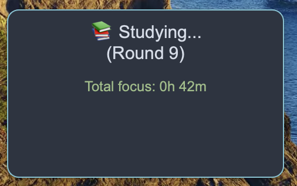

# EZLockIn (Immersive Study Timer)

A desktop study companion designed to fight **timer anxiety**.  
EZLockIn keeps you focused using two game-inspired mechanics: **randomness** and **rewards**.

---

## Origin & Philosophy

> **Why can games keep people playing for hours, but studying often feels hard to sustain?**  
> Many addictive games rely on two simple mechanics: **Randomness** (curiosity) and **Rewards** (positive feedback).  
> EZLockIn applies the same loop to studying.

### Game Mechanics → EZLockIn Mapping

| Mechanic | In Games | In EZLockIn |
| :-- | :-- | :-- |
| 🎲 **Randomness** | You don’t know what happens next, so your brain stays curious. | Focus session length is randomized (e.g., **3 min**, **5 min**, **3m 15s**). |
| 🎁 **Rewards** | Small wins make you want to repeat the loop. | After each focus session, you get a **10-second reward break**. |

**Result:** a lightweight “game loop” that makes studying feel easier to continue.

---

## Core Features

| Feature | What it does |
| :-- | :-- |
| 🎲 **Random Focus Cycles** | Randomly generates focus durations within a configurable range. |
| ☕️ **Smart Break System** | Automatically switches between short breaks and long breaks. |
| 📊 **Study Logging** | Logs each completed session to `study_log.csv` for review and analysis. |
| 🎨 **Highly Configurable** | Customize timings, sounds, and more using `config.json`. |

---

## Quick Start (Recommended)

> ✅ **macOS only** — this release is built for **MacBook / macOS** (not Windows).

### Download & Run (3 steps)

| Step | What to do |
| :-- | :-- |
| **1** | Go to the **GitHub Release** page: **https://github.com/Eriq7/EZLockIn/releases/tag/v1.0.0** |
| **2** | Download **EZLockIn-macOS.zip**, then unzip it |
| **3** | Open **EZLockIn.app** and start your focus cycle |

### If macOS blocks the app (Gatekeeper)

If you see “can’t be opened because it is from an unidentified developer”:

**Right-click** `EZLockIn.app` → **Open** → **Open** again (only needed the first time).

---

## Usage Guide

| Action | How |
| :-- | :-- |
| **Move** | Drag the window. |
| **Right-click Menu** | Right-click the window to access all features. |

#### Right-click Menu Options

| Feature | Description |
| :--- | :--- |
| **Status Info** | Shows current timer state and estimated time until a long break. |
| **▶️ Start / Resume** | Start the timer or resume from pause. |
| **⏸️ Pause** | Pause the current timer. |
| **✅ Always on Top** | Keep the window above other windows. |
| **💧 Opacity** | Adjust the window transparency. |
| **🔄 Reset** | **Reset Current Cycle**: Stops the current cycle and prepares a new one.<br>**Clear All Statistics**: Clears total accumulated focus time (**with confirmation**). |
| **📂 Open Log Folder** | Opens the program folder to view logs and configuration files. |
| **❌ Quit** | Saves data and safely exits the app. |

---

### UI Preview

**Frontend** — what the timer window looks like on your desktop.  


**Right-click Menu** — all controls are accessible from the context menu.  


**Statistics Output** — `study_log.csv` records your study sessions (start/end time + duration).  


---

## Custom Configuration (`config.json`)

On first launch, EZLockIn automatically creates a `config.json` file.  
Edit it with any text editor, then restart the app to apply changes.

(Partial parameter reference)

| Parameter | Description |
| :--- | :--- |
| `study_time_min` | Minimum focus duration per round (seconds). |
| `study_time_max` | Maximum focus duration per round (seconds). |
| `long_break_threshold` | Total accumulated focus time required to trigger a long break (seconds). |

---

## For Developers

If you want to run from source, follow these steps.

#### 1. Requirements

* Install [Python](https://www.python.org/) (3.8+ recommended)
* Clone this repo: `git clone https://github.com/Eriq7/EZLockIn.git`
* Enter the project folder: `cd EZLockIn`

#### 2. Install Dependencies

This project uses `requirements.txt` to manage dependencies.

```bash
pip install -r requirements.txt
```

#### 3. Run from Source

```bash
python study_timer_gui.py
```

---

## License

This project is licensed under the [MIT License](./LICENSE).
